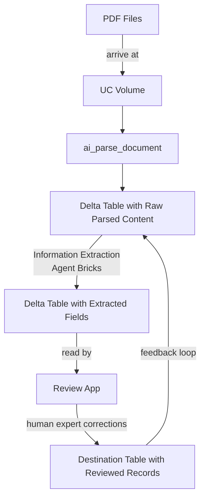

# Information Extraction Review App

A Streamlit app for reviewing and correcting the output of an information extraction pipeline. It reads records from a Unity Catalog Delta table, displays the source PDF alongside the extracted JSON side-by-side, and lets reviewers edit the JSON in place.

## Pipeline Overview



## How it works

Each row in the source table contains:
- a path to a PDF file stored in a UC Volume
- a JSON string with the extracted fields
- a raw text parse of the PDF (available as a secondary tab)

The app renders the PDF on the left and an editable JSON editor on the right. Once the reviewer is satisfied, clicking **Save** upserts the corrected record into a separate destination table, using the PDF path as the primary key.

## Running locally

**Prerequisites:** Python 3.10+, a Databricks CLI profile configured in `~/.databrickscfg`.

```bash
pip install -r requirements.txt
streamlit run app.py
```

The app connects to Databricks using the CLI profile defined by `DATABRICKS_CONFIG_PROFILE` (default: `e2`).

## Configuration

All settings are in [`config.py`](config.py) and can be overridden via environment variables. Copy `.env.example` to `.env` and adjust as needed (use a tool like [`python-dotenv`](https://pypi.org/project/python-dotenv/) or export them in your shell).

| Variable | Default | Description |
|---|---|---|
| `DATABRICKS_CONFIG_PROFILE` | `e2` | CLI profile for local auth |
| `SQL_WAREHOUSE_ID` | `c741aaf0c2ad0829` | SQL warehouse to query |
| `TABLE_NAME` | `pedro_zanela.ia.input_ocr_gabarito` | Fully-qualified UC source table |
| `COL_PDF_PATH` | `path` | Column with the UC Volume PDF path |
| `COL_LABELS` | `labels` | Column with the extraction JSON |
| `COL_RAW_CONTENT` | `raw_parsed` | Column with the raw text parse |
| `DEST_TABLE_NAME` | `cedip.ai.output_ocr_feedback` | Destination table for reviewed records |

## Deployment

Deploy as a [Databricks App](https://docs.databricks.com/en/dev-tools/databricks-apps/index.html). The platform injects `DATABRICKS_CLIENT_ID`, `DATABRICKS_CLIENT_SECRET`, and `DATABRICKS_HOST` automatically — no auth configuration is needed. The `app.yaml` at the project root defines the startup command.
