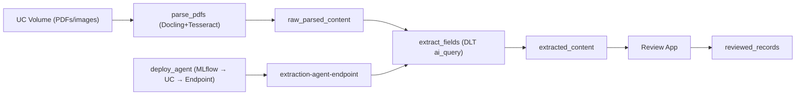

# Information Extraction Review App

Automates structured data extraction from Brazilian financial PDFs (Balanço Patrimonial + DRE) using Docling + a DSPy/MLflow agent, then provides a Streamlit app for human review and correction.

## Pipeline



| Step | Job task | Resource | Output |
|---|---|---|---|
| 1. OCR & parse | `parse_pdfs` | `parse_pdfs_notebook.py` (Docling+Tesseract → `ai_parse_document` fallback) | `raw_parsed_content` |
| 2. Deploy agent | `deploy_agent` | `driver.py` (MLflow log → UC register → Model Serving endpoint) | `extraction-agent-endpoint` |
| 3. Field extraction | `extract_fields` | `extract_pipeline` DLT (`ai_query`) | `extracted_content` |
| 4. Human review | — | Streamlit app | `reviewed_records` |

`parse_pdfs` and `deploy_agent` run in parallel; `extract_fields` depends on both.

## Deploy

```bash
# Validate and deploy all bundle resources
databricks bundle validate -t dev
databricks bundle deploy -t dev

# Run the full pipeline (parse → deploy agent → extract fields)
databricks bundle run extraction_job -t dev

# Start the review app
databricks bundle run review_app -t dev
```

Use `--profile=fevm` if your CLI profile is not set as default.

For production, use `-t prod` (writes to `ai_prod` schema).

## Run locally

```bash
pip install -r requirements.txt
streamlit run app.py
```

Requires a Databricks CLI profile (`fevm` by default) in `~/.databrickscfg`.

## Configuration

Bundle variables in [`databricks.yml`](databricks.yml) — override per target or at deploy time with `--var`.

| Variable | Default | Description |
|---|---|---|
| `catalog` | `cedip_fevm_aws_classic_stable_catalog` | Unity Catalog catalog |
| `schema` | `ai` | Source schema (reads) |
| `write_schema` | `ai` | Destination schema (writes); overridden to `ai_prod` in prod |
| `pdf_folder_path` | `/Volumes/.../input_files/` | Volume folder containing PDFs |
| `warehouse_id` | `2c3975c5e258e46b` | SQL warehouse for app and pipeline |
| `endpoint_name` | `extraction-agent-endpoint` | Model Serving endpoint for `ai_query` |

App runtime config lives in [`config.py`](config.py) and is overridable via environment variables:

| Variable | Default |
|---|---|
| `DATABRICKS_CONFIG_PROFILE` | `fevm` |
| `SQL_WAREHOUSE_ID` | `2c3975c5e258e46b` |
| `TABLE_NAME` | `cedip_fevm_aws_classic_stable_catalog.ai.extracted_content` |
| `DEST_TABLE_NAME` | `cedip_fevm_aws_classic_stable_catalog.ai.reviewed_records` |

## Repository layout

```
├── databricks.yml                              # Bundle: variables, targets (dev/prod)
├── resources/
│   ├── job.yml                                 # extraction_job: parse_pdfs + deploy_agent + extract_fields
│   ├── extract_pipeline.yml                    # extract_pipeline DLT definition
│   └── app.yml                                 # Databricks App resource
├── src/
│   ├── agents/
│   │   └── extractor/
│   │       ├── agent.py                        # DSPy ChainOfThought + MLflow pyfunc extraction agent
│   │       └── driver.py                       # Notebook: log → register → deploy to Model Serving
│   ├── pipelines/
│   │   ├── parse_pdfs/
│   │   │   ├── parse_pdfs_notebook.py          # Job task: Docling+Tesseract → ai_parse_document fallback
│   │   │   └── transformations/
│   │   │       └── parse_pdfs_docling.py       # DLT version (not used in job; kept for reference)
│   │   └── extract_fields/transformations/
│   │       └── extract_fields.py               # DLT: ai_query(endpoint) → extracted_content
│   ├── tests/
│   │   └── test_docling.py                     # Smoke test for Docling on Databricks
│   └── validation/
│       ├── evaluate_extraction.py              # Field-level accuracy vs Excel ground truth (1% tolerance)
│       └── validate_against_reference.py       # Side-by-side raw text vs Excel comparison
├── app.py                                      # Streamlit review app
├── config.py                                   # Runtime config (env-var driven)
├── databricks_utils.py                         # SDK helpers (query, save, fetch PDF bytes)
└── requirements.txt                            # Local/app dependencies
```
