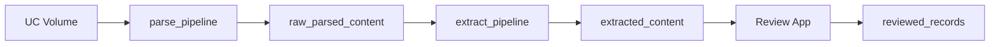

# Information Extraction Review App

Automates structured data extraction from financial PDFs using Databricks Agent Bricks, then provides a Streamlit app for human review and correction.

## Pipeline



| Step | Resource | Output table |
|---|---|---|
| 1. OCR & parse | `parse_pipeline` | `raw_parsed_content` |
| 2. Field extraction | `extract_pipeline` | `extracted_content` |
| 3. Human review | Streamlit app | `reviewed_records` |

## Deploy

```bash
# Validate
databricks bundle validate -t dev

# Deploy all resources (pipelines + app)
databricks bundle deploy -t dev

# Run pipelines in order
databricks bundle run parse_pipeline -t dev
databricks bundle run extract_pipeline -t dev

# Start review app
databricks bundle run review_app -t dev
```

## Run locally

```bash
pip install -r requirements.txt
streamlit run app.py
```

Requires a Databricks CLI profile (`fevm` by default) in `~/.databrickscfg`.

## Configuration

Settings live in [`config.py`](config.py) and are overridable via environment variables.

| Variable | Default |
|---|---|
| `DATABRICKS_CONFIG_PROFILE` | `fevm` |
| `SQL_WAREHOUSE_ID` | `2c3975c5e258e46b` |
| `TABLE_NAME` | `cedip_fevm_aws_classic_stable_catalog.ai.extracted_content` |
| `DEST_TABLE_NAME` | `cedip_fevm_aws_classic_stable_catalog.ai.reviewed_records` |

Bundle variables (`databricks.yml`) control catalog, schema, PDF volume path, warehouse, and Agent Bricks endpoint name.

## Repository layout

```
├── databricks.yml                          # Bundle: variables, targets (dev/prod)
├── resources/
│   ├── pipeline.yml                        # parse_pipeline definition
│   ├── extract_pipeline.yml                # extract_pipeline definition
│   └── app.yml                             # Databricks App resource
├── src/
│   ├── pipelines/
│   │   ├── parse_pdfs/transformations/
│   │   │   └── parse_pdfs.sql              # ai_parse_document → raw_parsed_content
│   │   └── extract_fields/transformations/
│   │       └── extract_fields.sql          # ai_query (Agent Bricks) → extracted_content
│   └── validation/
│       ├── evaluate_extraction.py          # Accuracy evaluation vs Excel ground truth
│       └── validate_against_reference.py   # Field-level comparison notebook
├── app.py                                  # Streamlit review app
├── config.py                               # Runtime config (env-var driven)
└── databricks_utils.py                     # SDK helpers (query, save, fetch PDF bytes)
```
